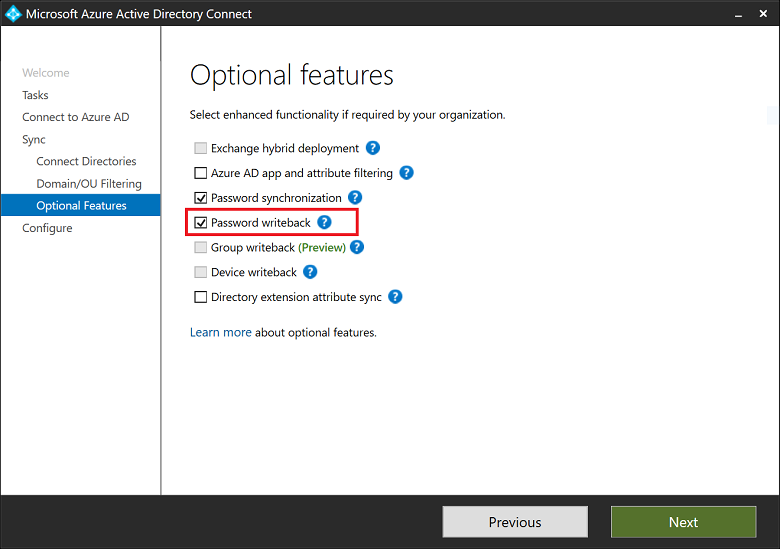

Do you have Password Writeback enabled in your Azure AD Connect?
 
If you want to let your users reset their own, on-premises passwords directly from the cloud, you need to have Password Writeback enabled in Azure AD Connect!

You can read more about Password Writeback from the Microsoft Documentation: https://docs.microsoft.com/en-us/azure/active-directory/authentication/howto-sspr-writeback

When setting up Azure AD Connect, you need to set the "Password Writeback" option:

