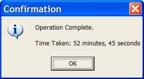
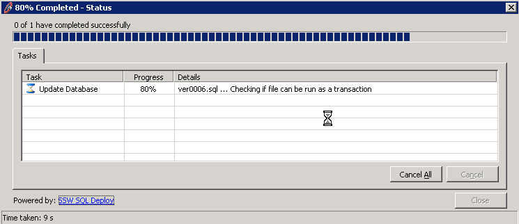

This feature is Particularly important if the user runs a semi-long task (e.g.30 seconds) once a day. Only at the end of the long process can he know the particular amount of time, if the time taken dialog is shown after the finish. If the status bar contains the time taken and the progress bar contains the progress percentage, he can evaluate how long it will take according to the time taken and percentage. Then he can switch to other work or go get a cup of coffee.

Also for a developer, you can use it to know if a piece of code you have modified has increased the performance of the task or hindered it.

<!--endintro-->

[[badExample]]
| 
[[goodExample]]
| 
