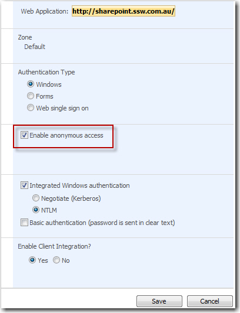
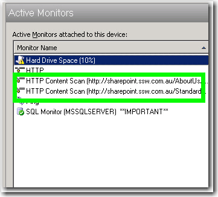

Any configuration settings, that you rely upon, must have a check so you get an email as soon as the problem arises. Eg. 
 An anonymous access check - A web publishing site needs a check to make sure anonymous access is configured correctly.

