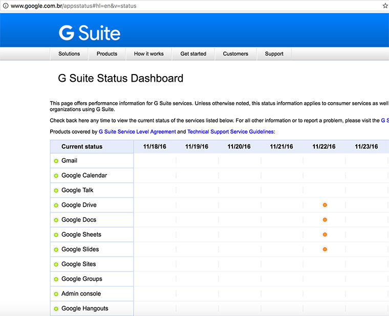

Websites should have an uptime report to provide real-time and historical performance and availability information. 

<!--endintro-->

Plus, with history information, you can get exact downtime of your website or services in the past.
<dl class="goodImage">   <dt>
      
       
   </dt><dd>Figure: Google's uptime reports - with history information. 
      <a href="http://www.google.com.br/appsstatus" target="_blank">See it now</a> </dd></dl>
