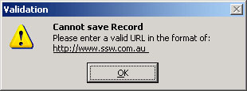
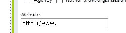

Most developers seem to validate a URL and tell the user what they have done wrong                     only after the error happens. URL fields should show how the users must enter it.
 [[badExample]]
|                         
The better way is to have the user avoid the error with a good default.
[[badExample]]
|                         ](url-field-bad2.jpg)
