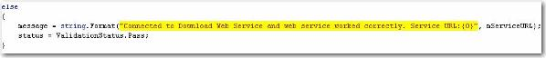

It is a good practice to highlight string variables or const in source code editor of Visual Studio to make them clear. Strings can be easily found especially you have long source code.   
<!--endintro-->

Default string appearance 
Highlighted string appearance 
Tools | Options form of Visual Studio
