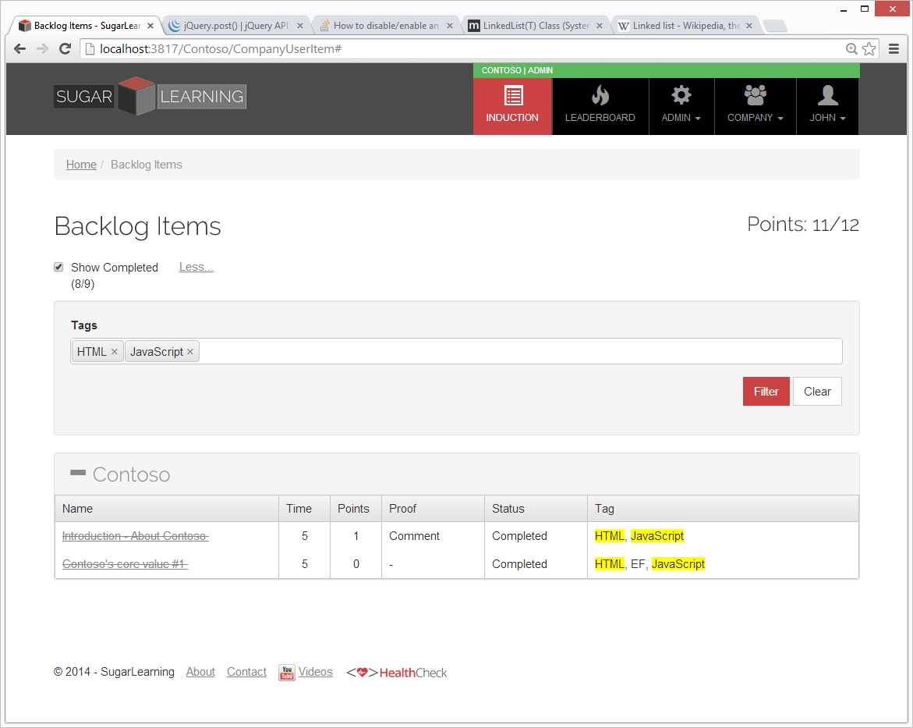

 
When implementing search on a website, do you know that it is best to highlight the search terms in the page body?
 
​Search is a common feature in websites, and one you will most likely have to implement at some stage. When search returns a list of items, it is useful to highlight the search terms where they appear in the results.

**Figure: Search for items with these tags**

**Figure: Search results have their relevant tags highlighted**

