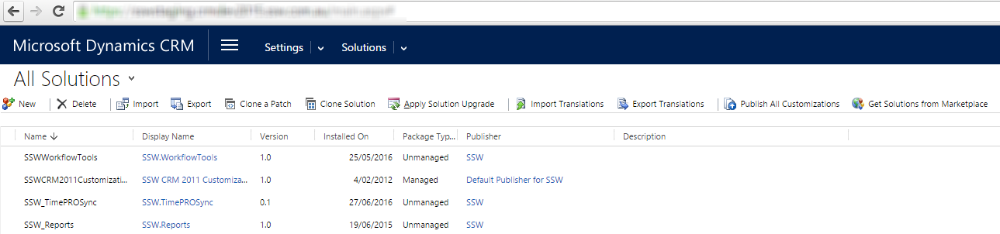
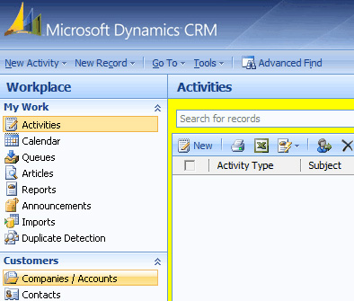
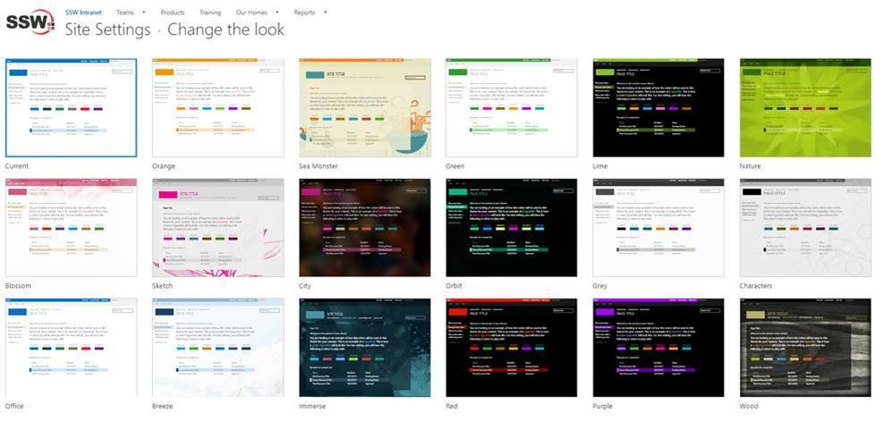

As per rule ["Do you have separate development, testing, and production environment?"](/_layouts/15/FIXUPREDIRECT.ASPX?WebId=3dfc0e07-e23a-4cbb-aac2-e778b71166a2&TermSetId=07da3ddf-0924-4cd2-a6d4-a4809ae20160&TermId=ae2ccef9-6cdc-4767-8e5a-e0e3dbf46fe2), it's better to use different background colors to identify Development, Test and Production servers.

### CRM 





The way to change the default background color is to edit the CRM CSS files. These changes aren't supported and may be overwritten when CRM Rollups are applied.

### CRM 2015 and CRM 2016


Using theme feature to change the environment color.


### CRM 2013

Edit: **\\_controls\navbar\navbar.css**

.navigationControl
{
background-color: #006600;
margin: 0;
z-index: 999;
float: left;
width: 100%;
position: relative;
}
 Figure: Edit the background color to reflect the environment

 

### CRM 2011

Edit     **\\_static\css\1033\cui.css**, locate and modify the section ms-cui-tabBody so that it reads:

background-color : #ffffff;

Change color to a suitable color for the environment:

background-color : #bbffaa;


### CRM 4

Edit,** \****\_common\styles\global.css.aspx**


```
body.stage
            {
                <% if (CrmStyles.IsRightToLeft) { %>
                    dir:rtl;
                <%} %>
                border-top:1px solid #6893cf;
​​
            /* background-color: #d6e8ff; */

            background-color: #ffff00;

            padding: 4px;
            
            /* background-repeat: repeat-x;
            
            background-image: url(/_imgs/app_back.gif);
                  */
            }
```

 Figure: In C:\Inetpub\wwwroot\\_common\styles\global.css.aspx comment out and change the reference in yellow so the users know what server they are on




 


### SharePoint online

Regarding the color codes, we use to differentiate Production to Test with SharePoint online.

Here is what we change:

- Site Settings | Change The Look
    - Test – Orange <br>            


    - Production - Office <br>            



(blue) theme applied
