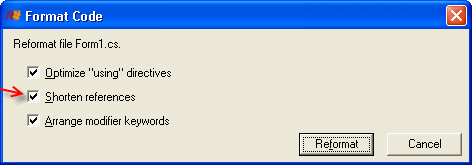

You should import namespaces and shorten the references.

<!--endintro-->

System.Text.StringBuilder myStringBuilder = new System.Text.StringBuilder();

::: bad
Figure: Bad code - Long reference to object name

:::

using System.Text;
...
...
StringBuilder myStringBuilder = new StringBuilder();

::: good
Figure: Good code - Import the namespace and remove the repeated System.Text reference

:::

If you have ReSharper installed, you can let ReSharper take care of this for you:
<dl class="image"><dt>
      
   </dt><dd>Figure: Right click and select "Reformat Code..." </dd></dl><dl class="image"><dt>
         
      </dt><dd>Figure: Make sure "Shorten references" is checked and click "Reformat" </dd></dl>
