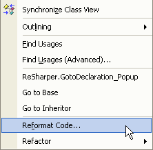

You should import namespaces and shorten the references.
 
System.Text.StringBuilder myStringBuilder = new System.Text.StringBuilder();
Figure: Bad code - Long reference to object name

using System.Text;
...
...
StringBuilder myStringBuilder = new StringBuilder();
Figure: Good code - Import the namespace and remove the repeated System.Text reference

If you have ReSharper installed, you can let ReSharper take care of this for you:

