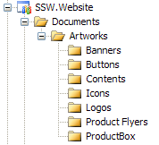

This field should not be null (Remove me when you edit this field). 
<!--endintro-->

(eg .PSDs in Source Control) 
We chose to exempt uncompressed video files as they tend to have large footprints and potentially cause delays in productivity. It is highly recommended that you have a separate backup procedure for these files.
