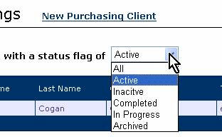
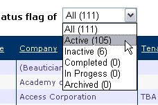

When designing your web site, it's a good idea to help your users where possible.                     When you use a combo box, it's very helpful to be able to see at a glance how many                     results can be expected.
 
[[badExample]]
|                         

[[goodExample]]
| 
