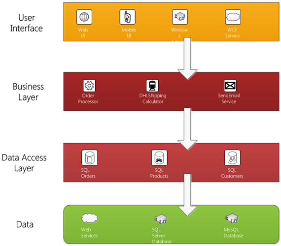

Injecting your dependency gives you:

- Loosely coupled classes
- Increased code reusing
- Maintainable code
- Testable methods
- All dependencies are specified in one place
- Class dependencies are clearly visible in the constructor

 
