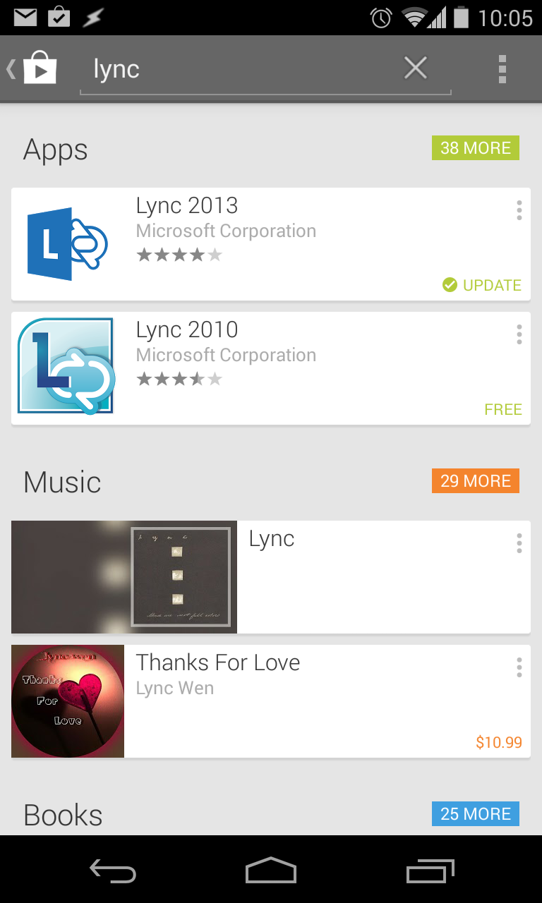
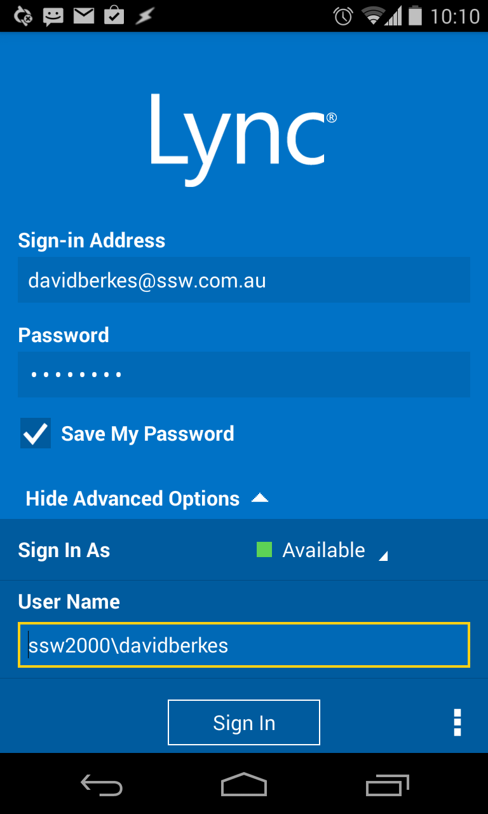

 ​​Installing MS Lync client on Andriod devices. Employees should be contactable no matter if they are in the office or not  (at a client). By installing the Lync client, everyone knows where they are and if they are available to take calls or answer questions that may arise. 
1. Search for “Lync” in the [Play store](https://play.google.com/store)Figure: Search for Lync in Playstore
2. Install the Lync client on device
3. Set up Lync to sign into your account as follows: Figure: Lync sign in process    You just need to enter 3 fields:

    - Sign in address is** your email address**
    - Password is        **your AD password**
    - Username is domain\username. For example SSW2000\davidberkes

Read more about     [​implementing Microsoft Lync](http://www.ssw.com.au/ssw/Consulting/Lync.aspx).

