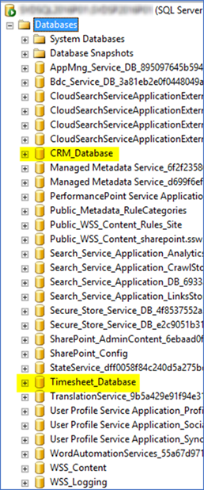
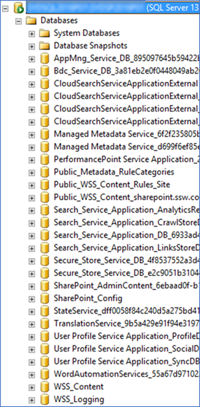

Because SharePoint server will create quite a few databases, it’s easier to manage them in a separate SQL instance rather than mixing it with other system’s databases:
 ​​​
Bad example - mixed with other systems' database​​​
Good example - SharePoint related databases are in a separate SQL instance from other systems' databases​
