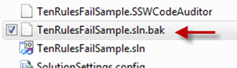

Finding a file with a BAK extension is a "call sign" that your folders need a tidy up. 
<!--endintro-->

We have a program called     [SSW Code Auditor](http://www.ssw.com.au/ssw/CodeAuditor) to check for this rule.
