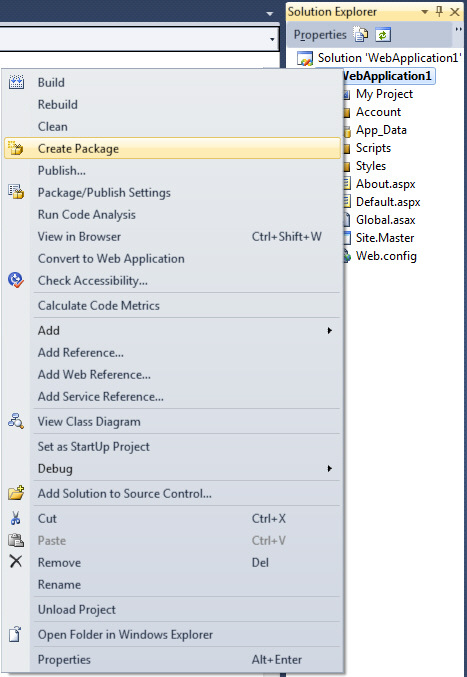
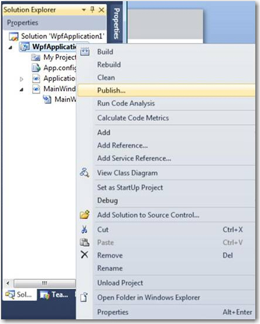
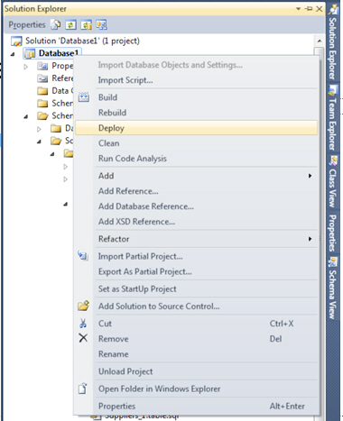

You have worked hard on the coding, got a pass from the testers. Great! Now you have approval to deploy to production. With VS 2010 deployment becomes easier and easier, you can choose different ways for different kinds of projects.

 For example:   
- Web Clients
    - Right click "Publish" (recommended if you can directly connect) 
         or
    - Right click "Create Package"

- Rich Clients
    - Right click "Publish" (recommended if you can use ClickOnce) 
         or
    - Right click "Create Setup" (Suggestion to Microsoft as menu doesn't exist)

- The Database     

 Now all this works beautifully first time, when there is no existing database... and no existing data to worry about. Now you have a reason to read the rest of the rules :-)
