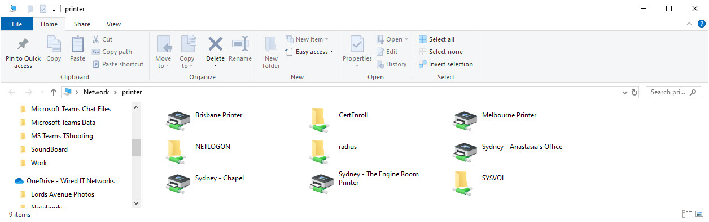

When you are connected to the SSW network, you may complete the following procedure.

Go to **\\printer**

<!--endintro-->
<dl class="image"><dt></dt><dd>Figure: Printers listed in Printer Server</dd></dl>
Double click on Printer to connect/add the printer. Follow prompt to finish adding printer (printer driver installation).
