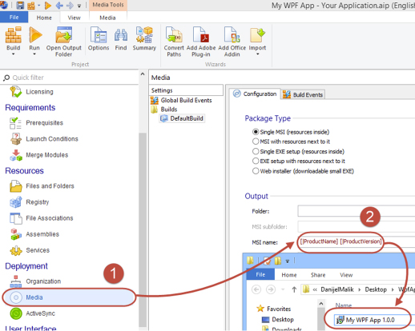

​Developers should add a version number at the end of the out package. E.g. SSWCodeAuditor\_v14.0.0.exe

Here is how you do it in Advanced Installer:
 
1. ​In the navigation pane look for        **Media**
2. Choose        **Configuration** tab and click in        **MSI name** text box which is located under        **Output** section
3. Next to the text add        [|ProductVersion]. If the text-box is empty you may want to start it with        [|ProductName]

Figure​: Advanced Installer - Add version to output package
