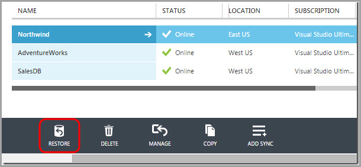

**Built-in Automatic Backup in Azure SQL Database**

Microsoft Azure SQL Database has built-in backups to support self-service Point in Time Restore and Geo-Restore for Basic, Standard, and Premium service tiers.
 
You should use the built in automatic backup in Azure SQL Database versus using T-SQL.

> T-SQL: CREATE DATABASE destination\_database\_nameAS COPY OF[source\_server\_name].source\_database\_name

Figure: Bad example - Using T-SQL to restore your database
[[goodExample]]
| 

Azure SQL Database automatically creates backups of every active database using the following schedule: Full database backup once a week, differential database backups once a day, and transaction log backups every 5 minutes. The full and differential backups are replicated across regions to ensure availability of the backups in the event of a disaster.

**Backup Storage**

Backup storage is the storage associated with your automated database backups that are used for Point in Time Restore and Geo-Restore. Azure SQL Database provides up to 200% of your maximum provisioned database storage of backup storage at no additional cost.

| Service Tier | Geo-Restore | Self-Service Point in Time Restore | Backup Retention Period | Restore a Deleted Database |
| --- | --- | --- | --- | --- |
| Web | Not supported | Not supported | n/a | n/a |
| Business | Not supported | Not supported | n/a | n/a |
| Basic | Supported | Supported | 7 days | √ |
| Standard | Supported | Supported | 14 days | √ |
| Premium | Supported | Supported | 35 days | √ |

Figure: All the modern SQL Azure Service Tiers support back up. Web and Business tiers are being retired and do not support backup. Check [Web and Business Edition Sunset FAQ](https://msdn.microsoft.com/en-us/library/azure/dn741330.aspx) for up to date retention periods.

**Learn more:**

- Microsoft documentation - [Azure SQL Database Backup and Restore](https://msdn.microsoft.com/en-us/library/azure/jj650016.aspx)
- Video demo on Channel 9 - [Restore a SQL Database Using Point in Time Restore](http://channel9.msdn.com/Blogs/Windows-Azure/Restore-a-SQL-Database-Using-Point-in-Time-Restore)

**Other ways to back up Azure SQL Database:
**

- Microsoft Blog - [Different ways to Backup your Windows Azure SQL Database](http://blogs.msdn.com/b/mast/archive/2013/03/04/different-ways-to-backup-your-windows-azure-sql-database.aspx)

**
**
