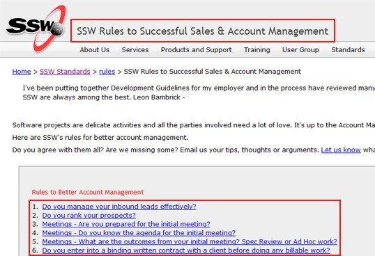

It is important to use correct capitalization when writing titles/headings for things.

"The Lord of the rings – Return of the king"
Figure: Bad Example – The first letter of the first and last words should always be capitalized
"The Lord of the Rings – Return of the King"
Figure: Good Example – Only conjunctions and prepositions (both having similar rules) should not be capitalized e.g. at, on, but, and, with etc.
 
It's best to only do this on main titles (which are important), and leave subtitles in normal sentence form. Basically it saves hassles... English is a confusing language and there are too many variations that cause too many arguments.

[[goodExample]]
| 
