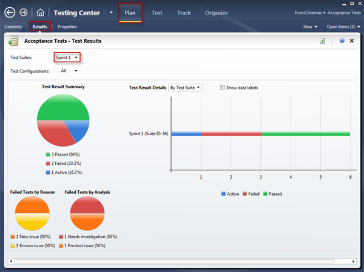

Developers think they are done when they finish coding and check in.

Wrong. It is much better to [use Microsoft Test Manager (MTM) and step through the Acceptance Tests.](/Pages/Do-You-Run-Acceptance-Tests.aspx)

Once you are doing that, this is how you check the status of the current Sprint:
 [[goodExample]]
| 
Key:

- The red is work remaining for the developers, and
- The blue is working remaining for the testers (unfinished testing)
