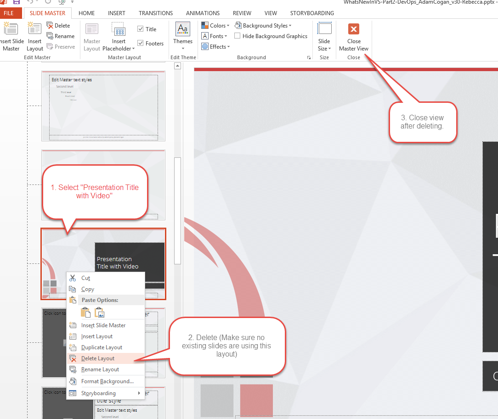
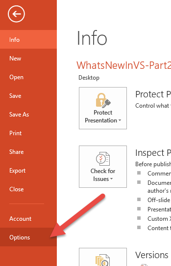
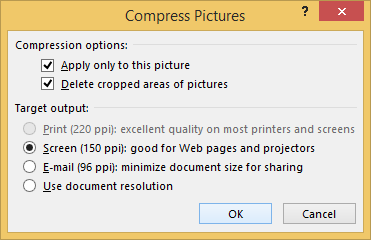
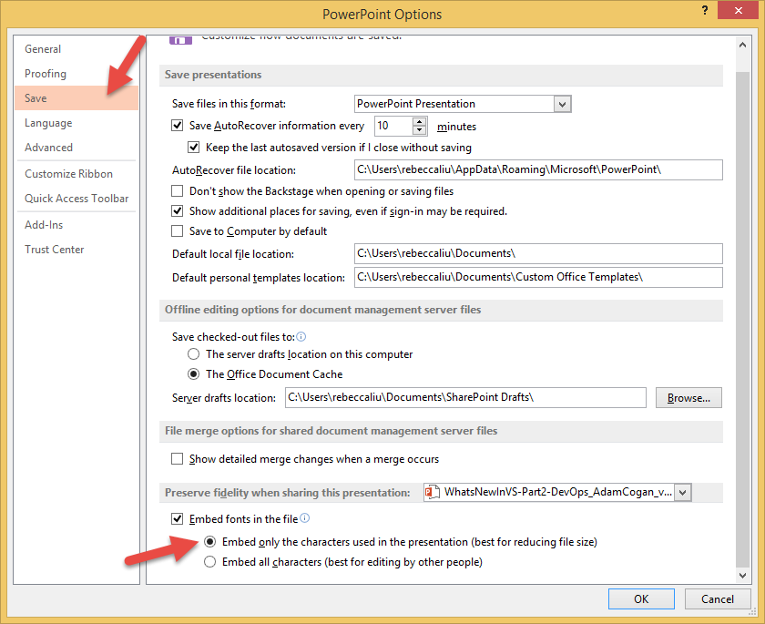
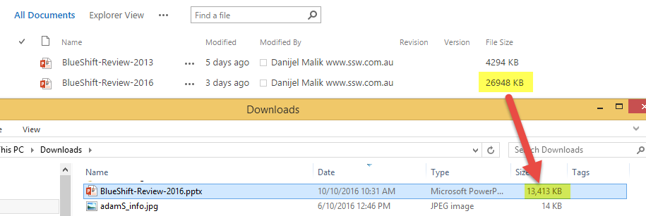

Unfortunately, when you “Send As Email” it doesn’t compress the file; this is how to compress a PowerPoint for emailing.
 

### Remove the video from the master slide.

This has been done in the 3.8 release of the template, but for old templates you may have to do this manually.
](01.png)
 

### Compress ALL your images
](05.png)

### Compress individual images (not recommended)
](03.png) 

### Compress font - ONLY DO THIS WHEN YOU ARE FINISHED EDITING

### Save as "YourFileName\_compressed.pptx."
 Do not override your original. You should always keep a high-res master of any media document.

If you find your files are still rather big after compression, you can export the PowerPoint to determine which particular slide is taking up all that space.        http://www.addictivetips.com/windows-tips/find-which-slide-in-your-powerpoint-presentation-is-the-largest-in-size/

### The result

Your own mileage may vary.

