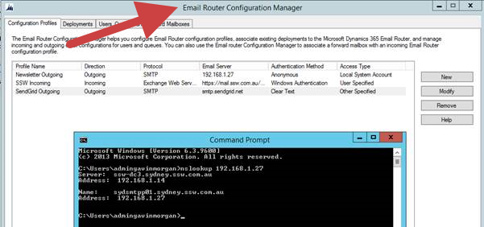

 ​When configuring your email settings for Dynamics CRM, make sure you configure Serverside Sync.
 
As per CRM Tip of the Day https://crmtipoftheday.com/979/start-planning-farewell-party-for-email-router/, the CRM Email router is to be deprecated. You should use the Serverside Sync now instead.​
 Figure: Bad Example - Deprecated Mail routed Enabled Figure: Good Example - Serverside Sync configured as per https://technet.microsoft.com/en-us/library/mt622063.aspx 

