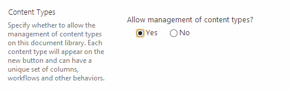
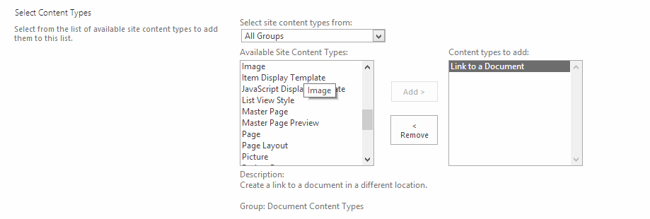
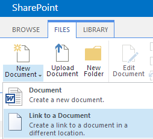

TODO TIAGO: ADD IMAGE OF WINDOWS EXPLORER (4 files in it) AND ANOTHER WITH SHAREPOINT DOCUMENTS LIBRARY

You may need a link in a SharePoint document to help you navigate to a different URL (like shortcut in Windows), there are different ways to implement this.

A.  Create a shortcut in windows, then upload the shortcut file (.url) to the document library.B. Use "Link to a document" content type in SharePoint.

 
Details on how you to create a link to a document in a SharePoint library.

**A. Create a shortcut in windows, then upload the shortcut file (.url) to the document library. **

To do this, you need to remove .url file type from your blocked file types in your web application. This will bring some security risk, which is not recommended, and I won't show the step details here.

**B. Use "Link to a document" content type in SharePoint.**

1) Enable "Content Type management" in your document library.

2) Add "Link to a Document" content type into the library.

3) Create a "Link to a document" instance

(dropdown) | Link to a document"

4) Done

You should be able to see the link type document in your library:

