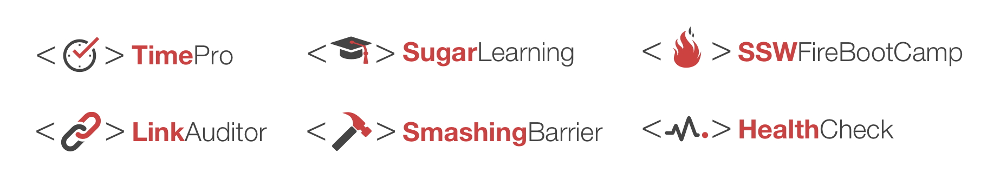
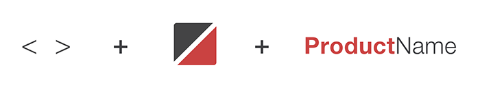
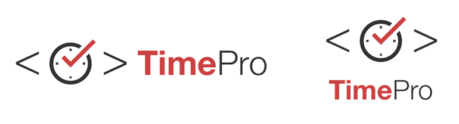

​​​Product logo design is an important tool when it comes to promoting SSW’s products or services. An SSW product logo must have a unique design that incorporates with SSW corporate visual concept and colors, makes a lasting positive impression on our customers.
 ​​
 ​​Figure: Good Example​​ - Some of the current SSW Product Logos

### 1. The main parts of an SSW product logo

A well designed SSW product logo has three parts: a pair of angle brackets, an icon, and the product name.  

​​Figure: Main parts of an SSW product logo

###  2. The color of an SSW product logo

 The colors used on the SSW product logo are the primary colors of SSW which are red and charcoal.

| #CC4141 | RGB (204,65,65) | #333333 | RGB (51,51,51)  |
| --- | --- |

An SSW product logo can be shown in these color variations: Two-Colored, SSW charcoal, true black, or all white.

​​​​​​Figure: Good Example - ​TimePro logo in 4 different colors

### 3. The font of an SSW product logo

The font used on SSW product logo is Helvetica Neue LT Pro​, the font weight for the first part of the product name is 75 Bold, for the second part of the product name is 45 Light. ​​

### 4. The vertical layout of an SSW product logo

A vertical layout version should also take consideration when creating an SSW product logo. Place the icon set and product name vertically, make the product name 80% of the original size (e.g. 30pt for original, 24pt for vertical).

