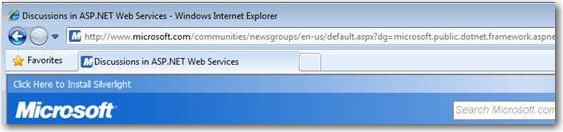
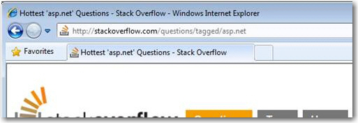

There are a lot of reasons to have nice URLs for your website:<br>
- Easy to remember
- Easy to navigate
- Better for search engines


[[badExample]]
| 
[[goodExample]]
| 
With ASP.NET 4 it is easy to create this URLs. The ASP.NET team includes routing features, known from the MVC web framework.
 Add a route in Global.asax


```
protected void Application_Start(object sender, EventArgs e){    //RouteTable and PageRouteHandler are in System.Web.Routing    RouteTable.Routes.Add("ProductRoute",        new Route("products/{productname}",        new PageRouteHandler("~/ssw/Products/ProdCategoryList.aspx")));}
```

Figure: Example on how to route www.ssw.com.au/products/{everything} to the www.ssw.com.au/ssw/Products/ProdCategoryList.aspx page 
**Note**: There is no dependency on the MVC framework in order to use this code.
**Note**: IIS7 has a module called [URL rewrite module](http://www.iis.net/learn/extensions/url-rewrite-module/using-the-url-rewrite-module) that can do this functionality without changing any code. Just a configuration of a "Rule" in the IIS Manager.
