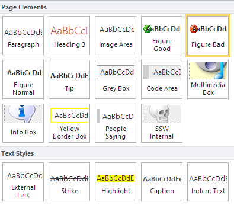
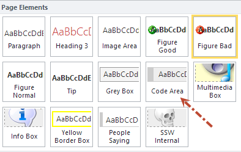
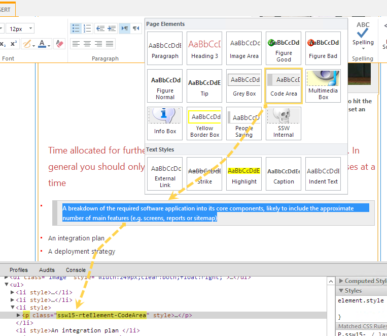
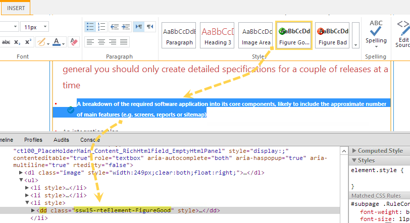
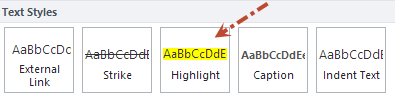

As a CMS system, it's obviously necessary to apply standard styles to all content, so the whole site looks consistent.

This rule outlines how to use custom styles in the SharePoint  RichHTMLEditor.

In SharePoint, we can use the below way to apply custom styles:

 
To do this:

1. You can use " **PrefixStyleSheet** " property to apply the custom styles to a build-in  **RichHtmlField** in page layout or master page. In my case, I applied them to a custom control " **ParsedRichHtmlField** " which inherited from the system build-in one.

**PrefixStyleSheet="ssw15-rte"** CssClass="ssw-inputeditorfield" id="Content" FieldName="PublishingPageContent" InputFieldLabel="Rule Summary Info" runat="server"/>

2. Refer an additional css file in the page layout or master page (apply to display mode content).

/>

3. Refer the additional css file again in " **edit mode** " in the page layout or master page (apply to edit mode editor).

After="<% $SPUrl:~sitecollection/Style Library/~language/Themable/Core Styles/pagelayouts15.css %>" runat="server"/>

**After** ="<%$SPUrl:~sitecollection/Style Library/~language/Themable/Core Styles/ <strong>editmode15.css</strong> %>" />

Use " **After** " property to ensure that it will be loaded after the " **editmode15.css** ", which is SharePoint default edit mode style. The custom style css file will be applied to the ribbon after users change to edit mode.

4. Add your custom styles definitions into the additional css file, all styles' names should start with the value you set for  **PrefixStyleSheet** , in our case, it's " **ssw15-rte** ". The custom styles can be applied to different areas (cases) in the ribbon.

1) .ssw15-rte **Language -** As SharePoint support multiple language, this definition will tell SharePoint which language will use those custom styles.

e.g.

.ssw15-rteLanguage-en {

-ms-name: English;

}

2) .ssw15-rte **Element -** tell SharePoint which element will be applied with this style. When you press "Enter" in SharePoint editor, it will automatically start a new paragraph with "

", so it's a brilliant choice to make some custom "paragraph" elements.
e.g.

P.ssw15-rteElement-CodeArea

{

**-ms-name:"Code Area";**

border: solid #CCC;

border-width: 1px 1px 1px 10px;

background: #EEE;

padding: 5px 10px;

margin: 8px;

overflow-x:auto;

display:block;

width:93%;

font-size:12px;

}

This  **Code Area** style will come up in "Page Elements" section:

While applying a "Page Elements" style, it will

- Remove all the styles for the children elements
- It may change both the class name and the parent element type, it depends on which html element has been specified in the definition.

For example, we change the style

from

**P** .ssw15-rteElement-CodeArea

to

**dd** .ssw15-rteElement-FigureGood

Its html code will change

from

to

to

3).ssw15-rte **Style -** this style could be applied to  **Text Styles** :

e.g.

.ssw15-rteStyle-Highlight

{

**-ms-name:"Highlight";**

background-color: #FFFF00;

}

This  **Highlight** style will come up in "Text Styles" section:

While applying a "Text Styles" style, it will

- nest the text in a  tag with the style class if the text is not already inside an HTML tag
- replace the class of the HTML tag if this tag is a  tag

That means all "Text Styles" will apply to  tag, and you cannot apply two "Text Styles" to one  (e.g. apply both Strike and Hightlight), you may have to do that via changing html source code manually, or creating a "combined" "Text Styles".

4) .ssw15-rte **Table -** Tell SharePoint the definition of custom table styles. After inserting a table, you can see the styles under "Design" tab:

e.g. The below is a " **SSW Table** " style definition:

.ssw15-rte **Table-** default

{

**-ms-name:"SSW Table";**

border:1px solid #ddd;

margin: 8px;

width:98%;

background-color:#f0f0f0;

}

After finishing the definitions of custom styles, make a package and deploy to a SharePoint site, Create a page using the page layout or master page which you added custom RichHtmlField style, then you should be able to see the custom styles in the ribbon.

Enjoy!
