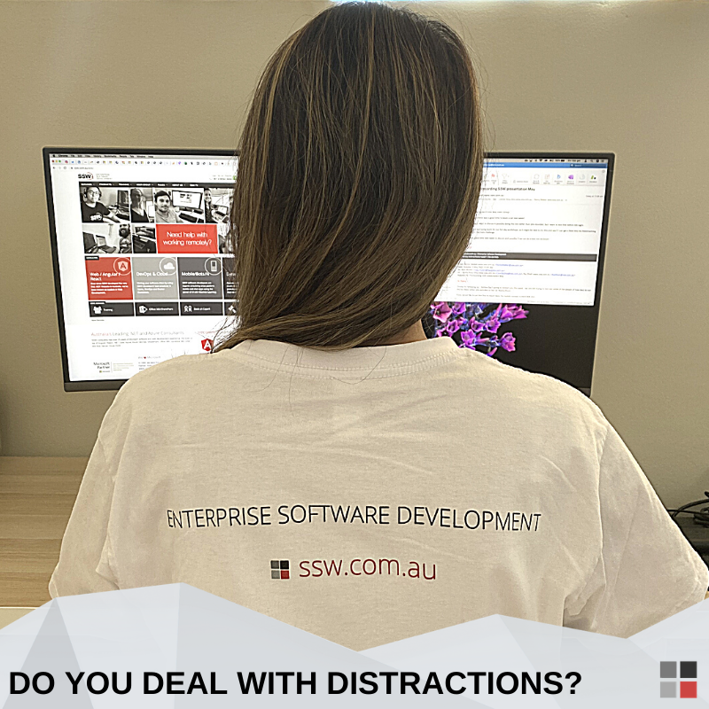

 **​​Keeping your mind on the job **is very important, especially when you're trying to fix a bug/issue or finalize a task to meet this afternoon's deadline. Here is how you keep "in the zone":​

 
1. ​Refer people to standards and you will be helping them learn + reducing the number of interruptions they get. This is why we invest in the SSW Rules.​
2. Avoid multi-tasking as much as possible. Don't open an email, respond to half the questions, and then open another. Complete the first task and then delete the email. When you multi-task, there’s a higher chance your work quality will be dropped, as well as your attention to detail.
3. Set your Browser's default to "About: Blank"  so you don't get distracted by news or social media, for example. **Tip:​​ **There is an extension for Google Chrome to replace your homepage called        [Momentum​](https://chrome.google.com/webstore/detail/momentum/laookkfknpbbblfpciffpaejjkokdgca?hl=en-US), where you will be shown a photograph as the background, time, greetings, and your own focus for the day.
4. Minimize Phone distractions. If you are in a meeting, it’s a good idea to put your mobile phone to “do not disturb”.
5. [Minimize Microsoft Teams distractions​](/_layouts/15/FIXUPREDIRECT.ASPX?WebId=3dfc0e07-e23a-4cbb-aac2-e778b71166a2&TermSetId=07da3ddf-0924-4cd2-a6d4-a4809ae20160&TermId=ab17d85c-5ee1-44a9-8433-200bd5771337).
6. [Minimize Outlook distractions](/_layouts/15/FIXUPREDIRECT.ASPX?WebId=3dfc0e07-e23a-4cbb-aac2-e778b71166a2&TermSetId=07da3ddf-0924-4cd2-a6d4-a4809ae20160&TermId=7d2b06ad-cac7-4afc-b7af-0552fe30b6ac).
7. [Minimize Skype distractions](/_layouts/15/FIXUPREDIRECT.ASPX?WebId=3dfc0e07-e23a-4cbb-aac2-e778b71166a2&TermSetId=07da3ddf-0924-4cd2-a6d4-a4809ae20160&TermId=6650d51f-dc2c-47d4-a779-2dc4f8a3c8c9).
8. People should        [avoid distracting you](/_layouts/15/FIXUPREDIRECT.ASPX?WebId=3dfc0e07-e23a-4cbb-aac2-e778b71166a2&TermSetId=07da3ddf-0924-4cd2-a6d4-a4809ae20160&TermId=3e0a3341-90ff-4b73-92d0-d14fb3e7ed13) - using IM unnecessarily can be evil. See [Do you know important chats should be in an email?​](/_layouts/15/FIXUPREDIRECT.ASPX?WebId=3dfc0e07-e23a-4cbb-aac2-e778b71166a2&TermSetId=07da3ddf-0924-4cd2-a6d4-a4809ae20160&TermId=dbad1760-3f29-4aa5-b24f-5e3fd60a05b3)
9. People will interrupt you less if you let them know what you are working on. **Tip: **Use the Teams status to let people know what you are doing (saves them having to ask you). See [Do you use the status message in Teams?](/_layouts/15/FIXUPREDIRECT.ASPX?WebId=3dfc0e07-e23a-4cbb-aac2-e778b71166a2&TermSetId=07da3ddf-0924-4cd2-a6d4-a4809ae20160&TermId=8deaea57-532b-4446-9eb2-f906830dd222)
10. Whenever you can, programming/working in pairs is great as it means you will be forced to focus, you won't cruise the web, or play Solitaire.
11. Use a concentration technique, such as        [Pomodoro​](https://en.wikipedia.org/wiki/Pomodoro_Technique).

Figure: Multi-tasking can be your deadline's enemy​​​​Figure: The ​Pomodoro technique **uses a timer to break down work into intervals, traditionally 25 minutes in length, separated by short breaks.**** **
