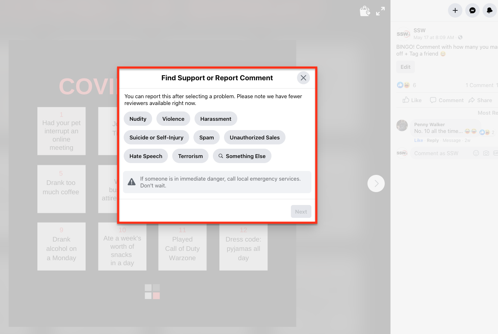

As social media becomes more and more popular and accessible, people leaving comments expressing their opinion about something they saw online is becoming more common, or even reviewing a new product on social media. Most people feel safe expressing their thoughts behind the mask of a social media profile and sometimes that can be challenging for companies to handle without ruining their brand image.
 
The manner by which companies handle negative and inappropriate comments says a lot about the brand, so managing comments on social media should also reflect the company values. Don’t forget that positive comments should have the same relevance and should be replied to with the same amount of effort.
 
Here are some points on handling negative comments:

### 1. Don’t block people who don’t agree with you

Unless you’ve received a disrespectful or hateful comment, don’t block users that have a different point of view to yours.

### 2. Understand the situation, apologize and fix the problem

A negative comment could be due to bad customer experience. In that case, first, understand what happened, show in your reply that you are sorry that a certain situation didn’t go as expected and that you understand how your client feels, as     [Neil Patel suggests](https://neilpatel.com/blog/unhappy-customers-into-resource/). Then show your client that you’ve fixed the problem, or that you are working on it (if it’s a long process to fix it). If a customer has raised an issue publicly, addressing it publicly is the way to go as it shows transparency and builds trust with your community. Responding to clients that have had a bad experience with your product or service is crucial on social media to encourage others to keep purchasing from your company.

### 3. If the problem is serious, reach out to the client through a private message

From the first comment, we can identify if a problem can escalate quickly, or if it’s harder to handle publicly. In cases like this, you can ask the client to contact you privately via email or direct message. This will hopefully take the damage offline and allows you to engage with the customer in a more personal way. It also allows other clients to see that you still responded and that you took action on a client's concern.

### 4. Remember that some people are just trolls!

If you got a new comment that is not from a client or a potential client, remember that some people are just trolls and want to make fun of everything. If the customer is unreceptive to your helpful replies or they start posting anything offensive or inappropriate on your page, it is perfectly reasonable to block them – but this should be the last option in most cases. If you can, verify that they actually were a customer of your business using your CRM system. Finally, keep in mind that replying could mean poking the bear, and you’ll only feed their need for attention even more. Some comments could be either about your product/service or about a meme you posted. If you get a sexist, hateful or political comment that has nothing to do with your post, you can discuss it with your team to see if it’s you should reply, delete, or just ignore it. For more, check [this article from Hootsuite with 9 tips for handling trolls on social media.](https://blog.hootsuite.com/how-to-deal-with-trolls-on-social-media/)

Making sure everyone from your team is on the same page about how to approach these situations is the best way to go. If you feel like you need to expand on this topic due to having a lot of inquiries and comments, we suggest you create a social media policy to cover all possible situations and how to handle each one of them.

**Tip 1:** You can use social media monitoring tools to keep track of the comments you get on social media, like Zendesk or Hootsuite.

**Tip 2:** Facebook allows you to hide comments, whereas other platforms require you to report the comment in order to hide it. On Facebook, if you hide a comment, the user who posted it (and the page manager) can still see it. User this feature if, for example, you want to hide a comment that didn't add value to the post, but wasn't offensive or didn't warrant deleting.
](Screen Shot 2020-06-02 at 8.37.31 am.png)
Figure: A few options Facebook gives you when reporting a comment
