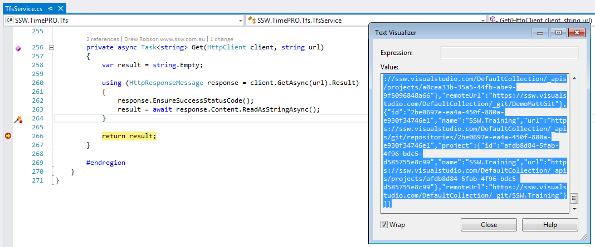

When integrating with external Web APIs which return a JSON response, there is a quick and easy way to generate classes to handle that response. 

Execute the request, and copy the text of the JSON response.

Create a new class in Visual Studio, and Click Edit | Paste Special | Past As JSON Classes and classes will be generated from the JSON in the clipboard.

The results may need cleaning up a little bit, but its much easier than trying to write them manually.
