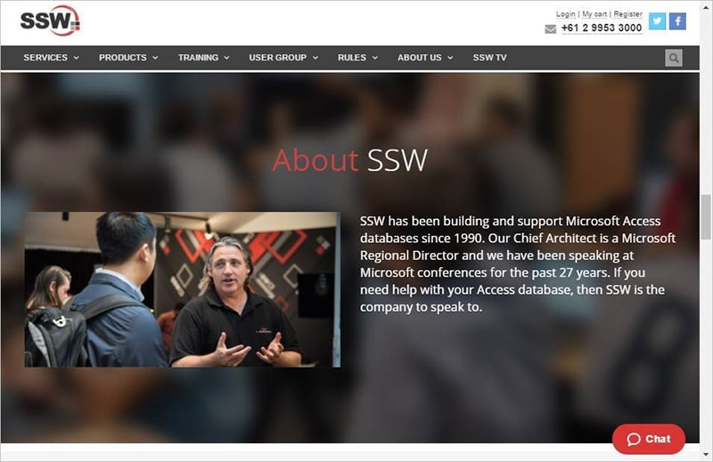
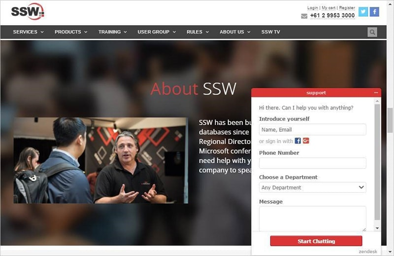
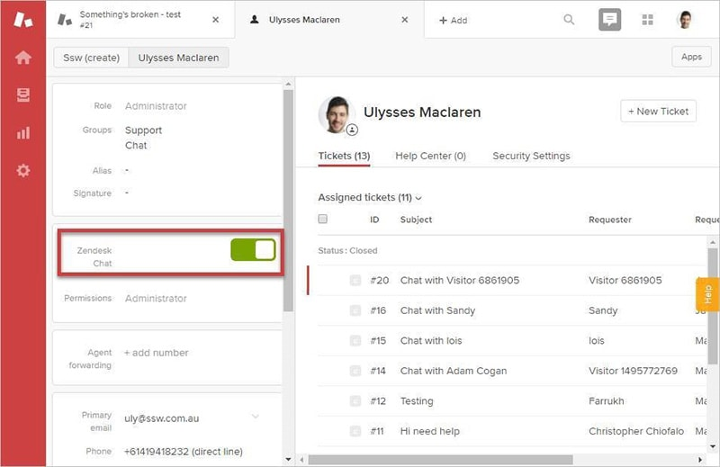

Zendesk support agents can have chat enabled, allowing them to answer chats from the website.

<!--endintro-->

To enable this, navigate to      **Admin** (cog) |      **People** |      **&lt;Agent’s name&gt;** | flick the “ **Zendesk Chat** ” switch:

**Note:** Be aware that this requires a chat license, so should only be enabled for people who will be doing it.
