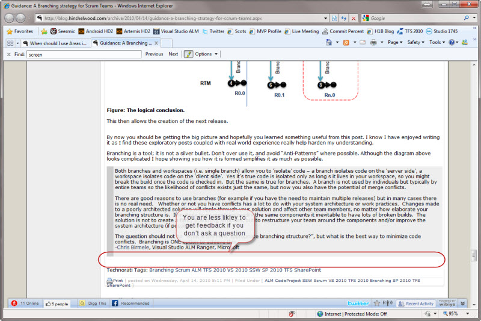
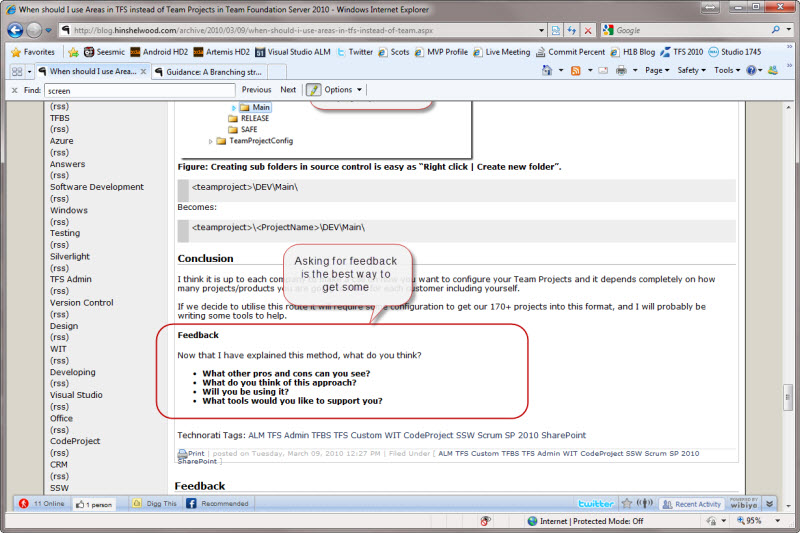

Whether you are converting an email to a blog post or writing it from scratch, always invite and instruct discussion.  

<!--endintro-->

[[goodExample]]
| 
Although people may not comply, it helps them adjust from the world of email only.
