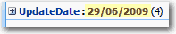
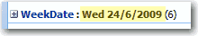

 
Figure: Bad example - using the default Date Format

Figure: Good example - using the Date Format with 'ddd'

**How do you do this ?**
  By default, the date type column only have two format options:

 Figure: Date Format #1  Figure: Date Format #2 
To add the week day(eg.Wed) you need to: 
1. Select List Settings | Columns |Create column | Calculated (calculation based on other columns)
2. See the columns of this list in the "Insert Column", add the column you want to change format, and custom the code in "Formula" like below:   
Figure: Calculated column with Formula code
3. Change the views of the list to use the new Calculated column (WeekDate) instead of the original date column (Date):  Figure: Replace the old Date column (Date) with new Calculated column (WeekDate It should not be this hard - see [suggestion to the SharePoint team to make date formatting easier](http://www.ssw.com.au/ssw/Standards/BetterSoftwareSuggestions/SharePointTeamServices.aspx#ChangeDateFormatShouldBeEasier).

