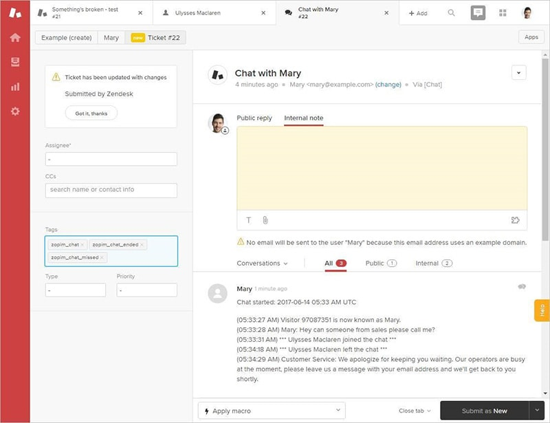

If you’re chatting with a client on Zendesk chat, and you realize you’re going to need to involve someone else, such as a salesperson, you can create a support ticket and assign it either to a sales group, or else a specific person.
 ](zendesk-handoff-1-min.jpg)
**Note:** You can also integrate with Dynamics 365 (AKA CRM) to pass over lead details from Zendesk straight to a Dynamics 365 lead.
