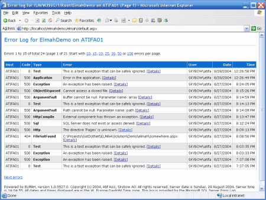

 
Your team should always be ensuring that the health of the application is continually improving.

The best way to do that is to check the exceptions that are being logged in the production application. Every morning, fix the most serious bug logged over the last week. After it is fixed then email yesterday's application health to the Product Owner.
 
There's traditional error logging software like Log4Net or Elmah, but they just give you a wall of errors that are duplicated and don't give you the ability to mark anything as complete. You'll need to manually clear out the errors and move them into your task tracking system (TFS/VisualStudio.com).

This is where RayGun or Application Insights comes into the picture. RayGun gives you the following features:

- Grouping exceptions
- Ignoring/filtering exceptions
- Triaging exceptions (mark them as resolved)
- Integrations to TFS/VisualStudio.com to create a Bug, Slack
- Tracking the exceptions to a deployment
- See which errors are occurring the most often

 Figure: Bad Example - Elmah gives you a wall of exceptions and no way to flag exceptions as completed 
**Hi Adam,** 
Please find below the Raygun Health Check for TimePro:

Figure: Raygun health check for TimePro in the past 7 days 
​
Figure: Resolved issues in the past 7 days​

Figure: The next issue to be worked on​

[https://rules.ssw.com.au/how-to-handle-errors-in-raygun/](/_layouts/15/FIXUPREDIRECT.ASPX?WebId=3dfc0e07-e23a-4cbb-aac2-e778b71166a2&TermSetId=07da3ddf-0924-4cd2-a6d4-a4809ae20160&TermId=6d5e516d-1f5e-4baa-929c-2c45b9bfa15e)>​
   Figure: Email with Raygun application health report​​​ 

