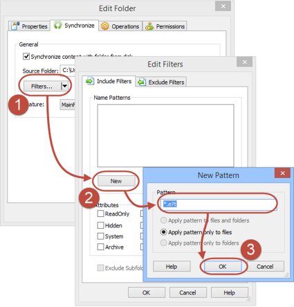

If you are syncing your Application Folder (or any other) with a local folder on a disk, you can specify which file or folders you want to sync. This is a very convenient way to keep your package smaller and clean.

Here is how you do it:
 
1. Right click the        **Application Folder** and choose        **Properties**
2. Click on Filters button to open the        **Edit Filters** dialog
3. Click on        **New** button to create Include pattern. Alternatively you can switch to        **Exclude Filters** tab
4. Enter the Pattern and press        **OK** on each screen

[[badExample]]
| 

[[goodExample]]
| 
