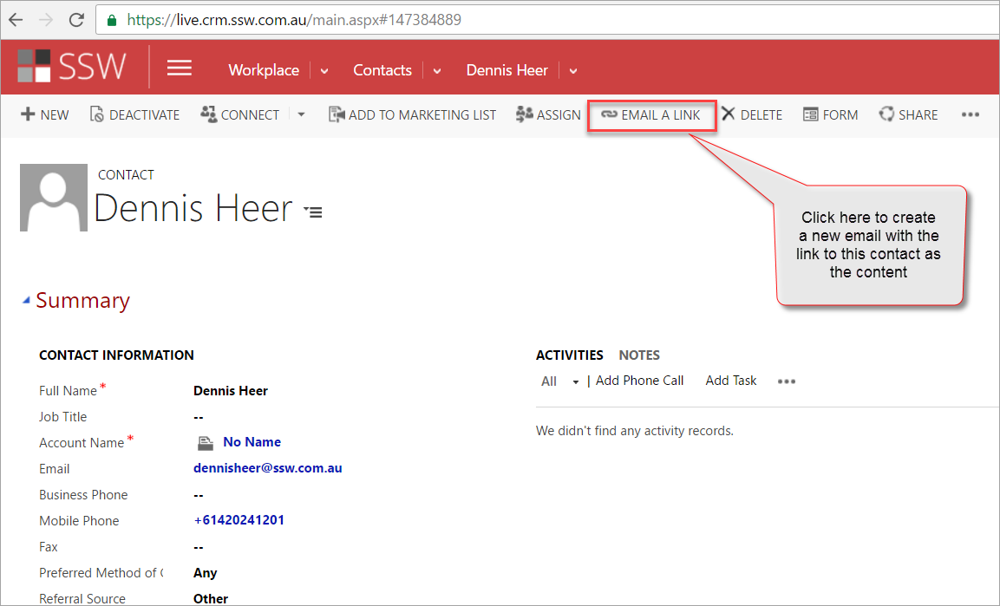
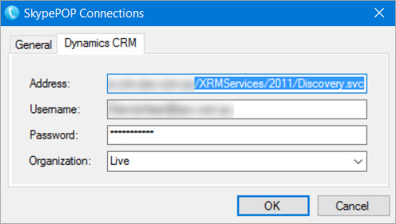
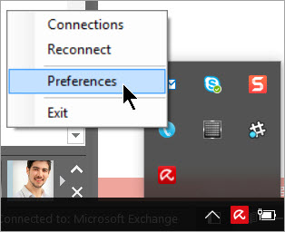
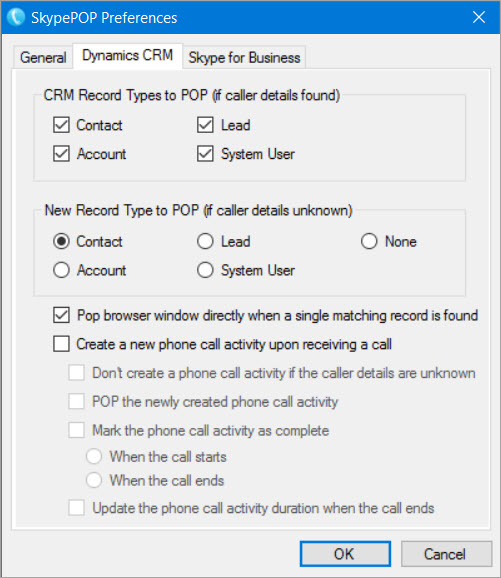

All company receptionists should install SkypePOP on your PC.
 
This will enable you to get Dynamics CRM contact popups on incoming calls, for example:

1. Bob Northwind calls you
2. His CRM contact will open up in your browser (by default before you pickup)
3. You now know exactly what you last talked about (by looking at the recent Activities and Opportunities)

There is one limitation to SkypePOP - forwarded calls won't give you useful information, as SkypePOP will show you the contact details of the person forwarding the call, not the external client. That's why we recommend using SkypePOP the following way:

<!--endintro-->

Only receptionists should have SkypePOP installed.

1.      An incoming call is taken by the receptionist

2.      The CRM contact pops up (or a "new contact" form if the number is not already in your CRM):

> 

> **Figure: Example contact popup on our CRM from incoming caller with the number +61420241201
> **

3.      Send Email

> 

> **Figure: This email will be created – send it to the person you are forwarding the call to
> **

4.      Inform the person the call is being transferred to that you have sent him an email with the CRM Contact

5.      Wow! No one has to open the CRM manually anymore

### How to Install SkypePOP

 

`youtube: https://www.youtube.com/embed/5tapdkp1vDg`
 

1.      Download and install SkypePOP from     [the official website](http://www.appvnet.com/)

2.  Open the         **Connections** settings

> 
> Figure: Right click on the SkypePOP icon in the taskbar

3.      Add your CRM connection details
Tip: Go to Main | Settings | Customizations | Developer Resources in order to find the address for your CRM

> **Figure: Copy the Endpoint Address for your Organization Service**
> 
> **Figure: Enter your CRM Connection Details
> 
> **
> 
> **
> **
> 
> **
> **

4.      Change the SkypePOP  **Preferences**

>  Figure: Right click on the icon in the taskbar and select “Preferences”

5.      Configure the         **Dynamics CRM** settings to something similar to this:        

> 

> **Figure: These are the default SkypePOP settings
> **

6.      Open Skype for Business

7.      Review the            **SkypePOP - Skype for Business** settings

>  **Figure: These are the default Skype for Business settings
> **

8.      Ensure both Dynamics CRM and Skype for Business are connected by clicking on the tray icon

> 
>  **Figure: Check that you are properly connected - blue is success 
> ** **
> **

The SkypePOP demo license will stop working after 5 hours or 5 calls
 **Tip: Reduce the time used by quitting SkypePOP - you do that by right clicking | Exit on the tray icon**

9.   Restart your PC.

10. Test with SNOM phone to verify SkypePOP is working correctly
