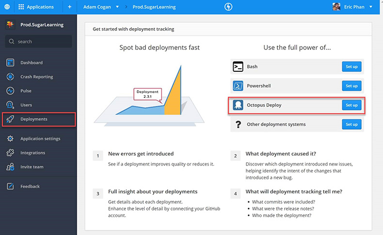

One of the best features of RayGun is the ability to track crash reports against deployments. This feature allows you to tell if a particular deployment has introduced a lot of new bugs or caused a regression of exceptions. 

To set it up:
 
1. Under Deployments
2. Select Octopus Deploy (Set up)
 
     Raygun will product you with a [PowerShell script](https://raygun.com/docs/deployments/octopus-deploy) to add into your octopus deployment steps that will call the RayGun API and log a new deployment
3. Trigger a new deployment
4. Then you’ll see the deployment in RayGun

    Drilling into a deployment you’ll see:

    - New errors
    - Regressions
    - Recurring errors

 
[[goodExample]]
| 
