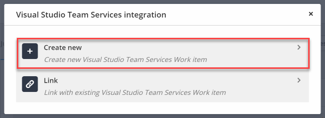
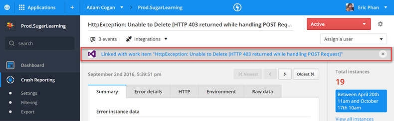

TFS/VisualStudio.com is the source of truth for product development, so how do you get issues in RayGun into TFS? Thankfully there’s a built in integration that lets you do that. 

<!--endintro-->

1. Under Integrations
2. Select Visual Studio Team Services
3. Connect to your TFS or VisualStudio.com instance

<dl class="image"><dt>
      
   </dt><dd>Figure: Link RayGun with TFS/VisualStudio.com</dd></dl>
Now under the crash report, you have to option to create a PBI and link it to the crash report.
<dl class="image"><dt>
      
   </dt><dd>Figure: Create a new PBI or link to an existing PBI</dd></dl>
Now you can see which RayGun create reports have already been added to the backlog.
<dl class="image"><dt>
      
   </dt><dd>Figure: Link RayGun with TFS/VisualStudio.com </dd></dl>

::: greybox
  RayGun is a useful tool to use for your DevOps. Check out our rule “[Do you know how DevOps fits in with Scrum?](/Do-you-know-how-DevOps-fits-in-with-Scrum)”

:::
