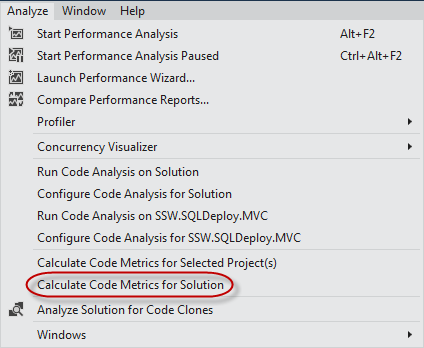
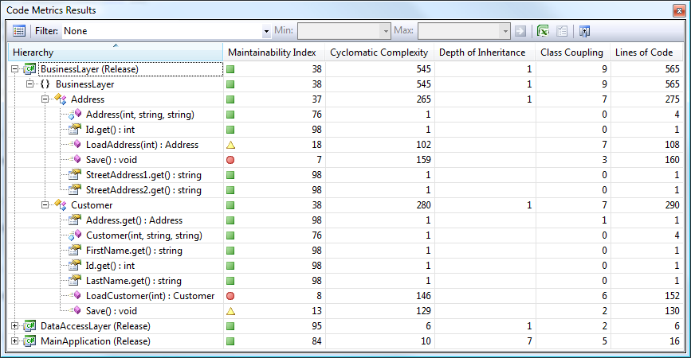
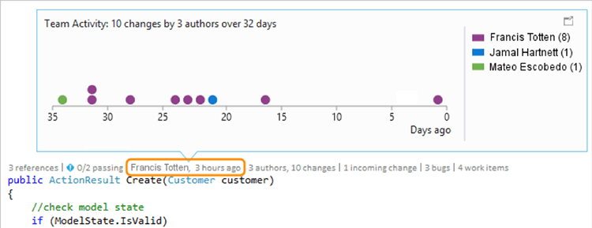

Rather than randomly browsing for dodgy code, use Visual Studio's Code Metrics feature to identify "Hot Spots" that require investigation.

<!--endintro-->

() and LoadCustomer()
Identifying the problem areas is only the start of the process. From here, you should speak to the developers responsible for this dodgy code. There might be good reasons why they haven't invested time on this.

[Do you know the benefits of Source Control?](http://www.ssw.com.au/ssw/Standards/Rules/RulesToBetterSourceControlwithTFS.aspx#UsingSourceControl)

::: greybox
 **Suggestion to Microsoft:** allow us to visualize the developers responsible for the bad code (currently and historically) using CodeLens.

:::
