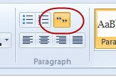

 
​When you add a quotation, put them in a new line with an indent.
 
​Software development can be painful and costly. Hang on, that should say "Software development IS painful and costly."
Figure: Bad Example - The quotation without a new line or indent
​​

Software development can be painful and costly. Hang on, that should say:
​  "Software development IS painful and costly."
Figure: Good example - The quotation on a new line and indenting​
You should always indent any quotes that you use on a new line.​

Figure: Bad example - It is hard to tell where the quote is​

​Figure: Good example - It is obvious that this is a quote and it is laid out nicely.

**
Tip: **In Windows Live Writer there is a button for this:

Figure: Use the Quote button in Windows Live Writer​

This wraps your text in a 

> HTML element. This lets you display it any way you like on a web page.​

