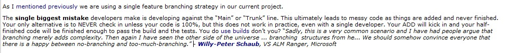

When you add a quotation, put them in a new line with an indent.
 
[greyBox]  Software development can be painful and costly. Hang on, that should say "Software development IS painful and costly."  [/greyBox]
Figure: Bad Example - The quotation without a new line or indent

[greyBox]  Software development can be painful and costly. Hang on, that should say:
  "Software development IS painful and costly."  [/greyBox]
Figure: Good example - The quotation on a new line and indenting
You should always indent any quotes that you use on a new line.

[[badExample]]
| 

[[goodExample]]
| 

**
Tip:** In Windows Live Writer there is a button for this:

This wraps your text in a 

> HTML element. This lets you display it any way you like on a web page.
