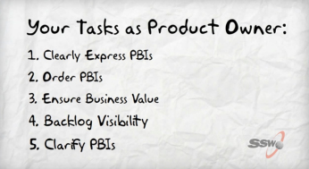

The Product Owner (PO) is responsible for managing the Product Backlog. This includes the following:  
[“What is a Product Owner” video](http://www.youtube.com/watch?v=3eljozEWpf8)
<!--endintro-->

1. Create clear PBIs
2. Order them by priority level
3. Make sure they’re useful to the business
4. Make sure everyone knows how to view the backlog
5. Clarify any unclear PBIs as needed
