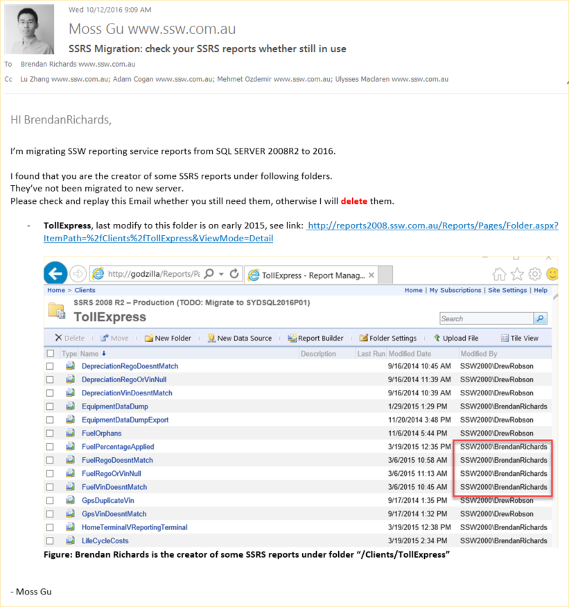
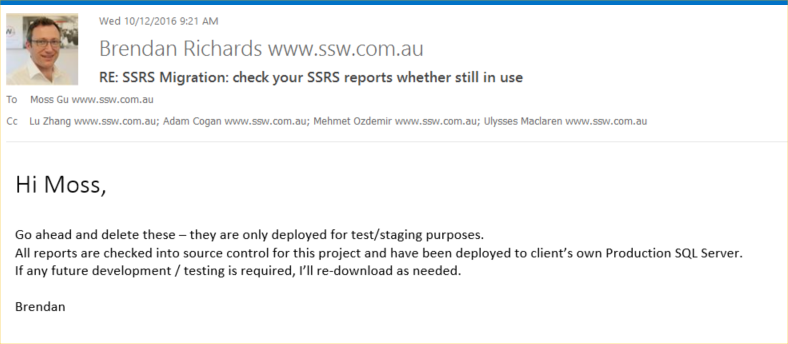

`youtube: https://www.youtube.com/embed/1knwXRIbVNw`
 
     Figure: How to migrate SSRS reports from an old server to another

Let's say you want to migrate SSRS reports from an old reporting service server (e.g., SQL Server 2008 R2) to a new one (e.g., SQL Server 2016). What involves?

There are three steps:
 
###  Step 1: Find the reports that don't need to be migrated

- You need to install [SSW SQL Reporting Service Auditor](https://www.ssw.com.au/ssw/SQLReportingServicesAuditor/ "SSW SQL Reporting Service Auditor")both on the old and new servers. (You'll also need to run it on 3rd step)
- Find those reports are not-in-use, as per a rule:        [Do you know which reports are being used?](/_layouts/15/FIXUPREDIRECT.ASPX?WebId=3dfc0e07-e23a-4cbb-aac2-e778b71166a2&TermSetId=07da3ddf-0924-4cd2-a6d4-a4809ae20160&TermId=ed18874b-3724-4388-8411-45f27f63f909)
- Find creators of those reports, by clicking “Detail Views” in reports folder       

- Send an email to report creater ask for permission to delete 

### 2. Migrate those in-use reports from old server to new server

> Tip: use the           [ReportSync](https://github.com/dapaxx/reportsync) tool to save time

### 3. Check audit results
    - Run SSW SQL Reporting Service Auditor on both sides
    - Compare audit results. Note that even error and warning messages also need to be the same
    If audit results are exactly the same on old and new servers, it indicates that migration is successful.
