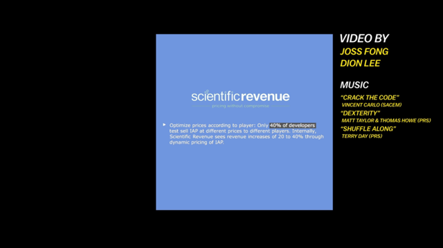
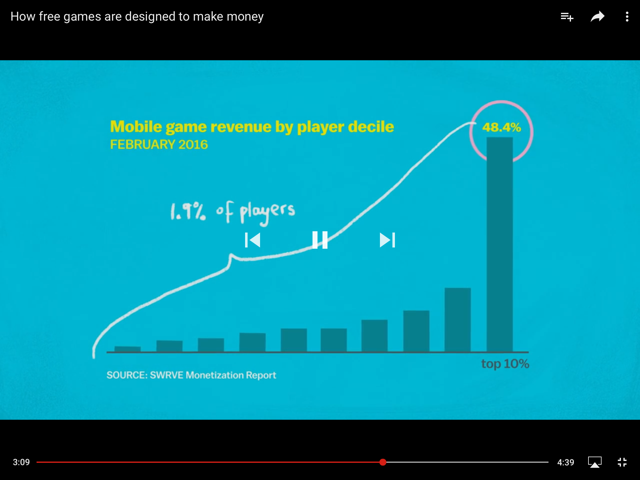

Do you know free games are designed to make money? See the good and bad examples:
 

 Bad example: paid apps
Good example: free apps with in-app purchases

Bad example: paid with currencyGood example: paid with abstract currency 

Bad example: treat all customers the sameGood example: detect when a customer might leave and offer them incentives

Bad example: same prices for everyoneGood example: capture data eg. What device and do data mining to set different prices 

 

