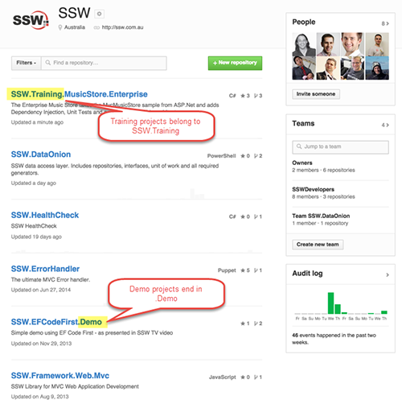

Consistent naming is important so that users of your GitHub account can easily find what they are looking for and so that you appear professional.
 
[[badExample]]
| 

[[okExample]]
| 

[[goodExample]]
| 
[CompanyName].[ProjectName]​
