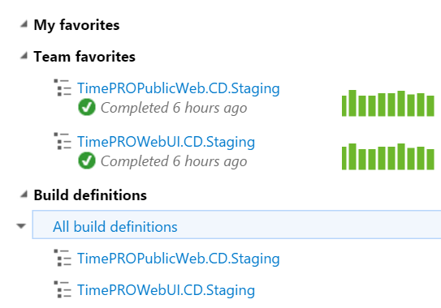

You should always follow a naming standard when naming your builds. This helps you identify their purpose at a glance. 

The build name should have the following suffixes, depending on their purpose:

- **.CI**  - For continuous integration builds. These are triggered automatically and do not deploy anywhere.
- **.CD.[Environment]**  - For continuous delivery builds. These are triggered automatically and deploy to an environment. You should specify which environment it deploys to as well.

