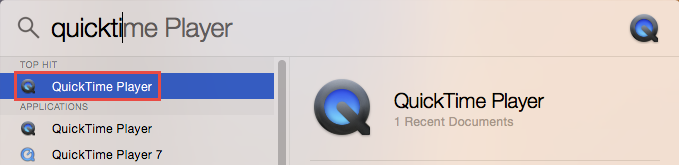

If you don't have Camtasia or ScreenFlow, you can use the built-in QuickTime Player to record the screen on Mac OSX.
 
Open the QuickTime Player through the Applications folder, or by using search (Ctrl + Space) and typing QuickTime:

From QuickTime Player, you can start a new Screen Recording from the File menu:

In the Screen Recording window, you an select which microphone to use if you want to record audio:

** Tip:** Alternatively, you can use [Loom](https://www.useloom.com/) 
, which works as a Google Chrome extension.

### Related Rule 

- [Do you know how to start recording with Camtasia?](/_layouts/15/FIXUPREDIRECT.ASPX?WebId=3dfc0e07-e23a-4cbb-aac2-e778b71166a2&TermSetId=07da3ddf-0924-4cd2-a6d4-a4809ae20160&TermId=84dca81b-9cc2-4b6a-a237-948304131b54)
