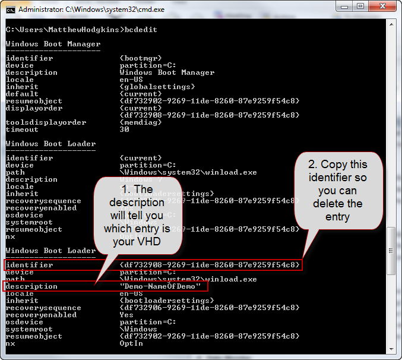

 When you have finished with the VHD for the presentation you will want to remove the boot entries that were created for the VHD.  
1. Open an administrative command prompt
2. View all the boot entries by typing: bcdedit 
Figure - The list Boot entries after running bcdedit
3. Using the **identifier** from the previous step you can now run the following command to delete the entry:
bcdedit /delete **{identifier}**
Figure - The boot entry has now been deleted

 You can now delete or move your VHD file and you will not get any errors when booting your laptop.   
